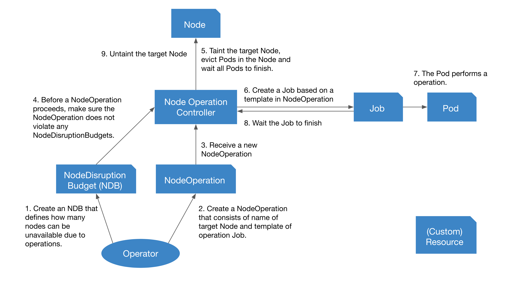
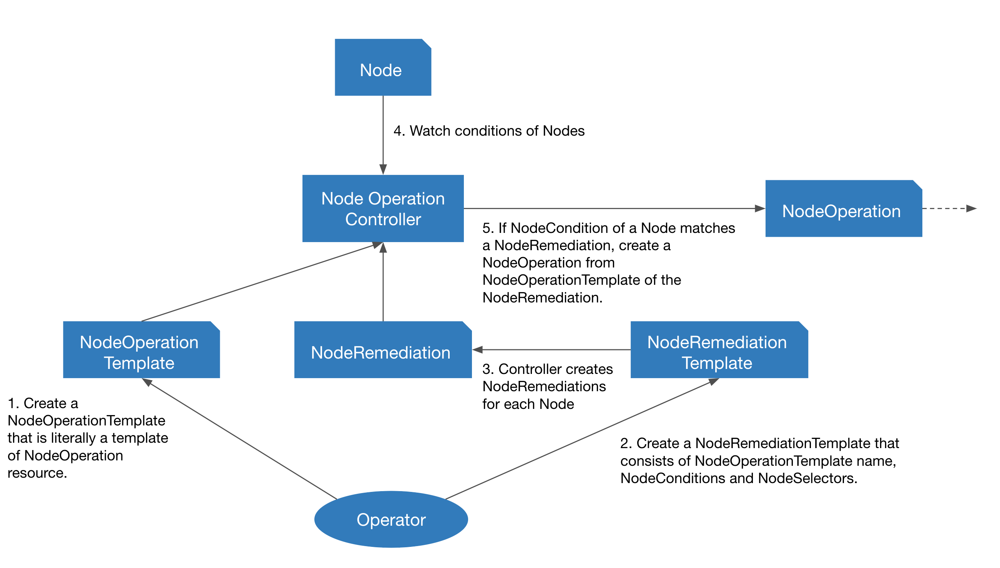

# Node Operation Controller

This is a Kubernetes controller for an automated Node operation. In general, if we perform a Node operation that affects running Pods, we need to do the following steps:

1. Make the Node unschedulable.
1. Evict running Pods in the Node and wait all running node to be evicted.
1. Perform the operation.
1. Make the Node schedulable.

Node operation controller automates these steps. In addition, this controller:

- watches NodeCondition and perform an arbitrary operation
- takes care count of unavailable Nodes due to the operation

## Table of contents

<!-- TOC -->

- [Node Operation Controller](#node-operation-controller)
    - [Table of contents](#table-of-contents)
    - [How it works](#how-it-works)
        - [NodeOperation and NodeDisruptionBudget](#nodeoperation-and-nodedisruptionbudget)
        - [NodeRemediation](#noderemediation)
    - [Custom Resources](#custom-resources)
        - [NodeOperation](#nodeoperation)
            - [`evictionStrategy`](#evictionstrategy)
            - [`nodeDisruptionBudgetSelector`](#nodedisruptionbudgetselector)
            - [`skipWaitingForEviction`](#skipwaitingforeviction)
        - [NodeDisruptionBudget](#nodedisruptionbudget)
            - [`maxUnavailable` and `minAvailable`](#maxunavailable-and-minavailable)
            - [`taintTargets`](#tainttargets)
        - [NodeRemediation](#noderemediation-1)
        - [NodeRemediationTemplate](#noderemediationtemplate)

<!-- /TOC -->

## How it works

### NodeOperation and NodeDisruptionBudget

1. When NodeOperation resource is created, go to next step
1. Confirm the NodeOperation does not violate NodeDisruptionBudgets.
    - If it violates NodeDisruptionBudgets, wait for other NodeOperations to finish.
1. Taint the target Node specified in NodeOperation.
    - The Taint is `nodeops.k8s.preferred.jp/operating=:NoSchedule`
1. Evict all running Pods in the Node.
    - By default, this uses Pod eviction API. You can control eviction by NodeDisruptionBudget.
    - This behavior can be configured by `evictionStrategy` option of NodeOperation.
1. After eviction, run a Job configured in the NodeOperation
    - The Pod created by the Job has `nodeops.k8s.preferred.jp/nodename` annotation which indicates the target Node.
1. Wait the Job to be in Completed or Failed phase.
1. Untaint the Node.



### NodeRemediation

For most operation team, they would have their own secret-sauce for daily operation. This means typical node failure can be cured by common recipe shared among the team. `NodeRemediation`, `NodeRemediationTemplate` and `NodeOperationTemplate` enable us to automate the common operation for known node issues.

- `NodeOperationTemplate` represents a template of common node operation.
- `NodeRemediation` defines 
  - target node to apply the remediation,
  - known failure by Node `conditions`, and 
  - corresponding `nodeOperationTemplate` to fix the failure.
- `NodeRemediationTemplate` defines 
  - target nodes to apply the remediation by `nodeSelector` and
  - a template of `NodeRemediation`.

Node operation controller watches nodes and if it detected the failure matches some `NodeRemediation`, then it creates `NodeOperation` from specified `NodeOperationTemplate` automatically.



## Custom Resources

### NodeOperation

```yaml
apiVersion: nodeops.k8s.preferred.jp/v1alpha1
kind: NodeOperation
metadata:
  name: example
spec:
  nodeName: "<operation target node>"
  jobTemplate:
    metadata:
      namespace: default
    spec: # batchv1.JobSpec
      template:
        spec:
          containers:
          - name: operation
            image: busybox
            command: ["sh", "-c", "echo Do some operation for $TARGET_NODE && sleep 60 && echo Done"]
            env:
            - name: TARGET_NODE
              valueFrom:
                fieldRef:
                  fieldPath: "metadata.annotations['nodeops.k8s.preferred.jp/nodename']"
          restartPolicy: Never

  evictionStrategy: Evict # optional
  nodeDisruptionBudgetSelector: {} # optional
  skipWaitingForEviction: false # optional
```

#### `evictionStrategy`

This controller has some ways to evict Pods:

- `evictionStrategy: Evict`: This strategy tries to evict Pods by Pod eviction API and it respects PodDisruptionBudget.
- `evictionStrategy: Delete`: This strategy tries to evict Pods by deleting Pods.
- `evictionStrategy: ForceDelete`: This strategy tries to evict Pods by deleting Pods forcibly.
- `evictionStrategy: None`: This strategy does not evict Pods and it just waits all Pods to finish.

#### `nodeDisruptionBudgetSelector`

By default, a NodeOperation respects all NodeDisruptionBudgets (NDB) but in some cases, some NDBs need to be ignored. (e.g. urgent operations)
If nodeDisruptionBudgetSelector is set, only NDBs whose labels match the nodeDisruptionBudgetSelector will be respected.

#### `skipWaitingForEviction`

By default, a NodeOperation waits for all pods drained by the eviction.
If skipWaitingForEviction is true, a NodeOperation skips waiting for the eviction finishing. It means that a NodeOperation ignores not drained pods.

### NodeDisruptionBudget

```yaml
apiVersion: nodeops.k8s.preferred.jp/v1alpha1
kind: NodeDisruptionBudget
metadata:
  name: example
spec:
  selector: # nodeSelector for Nodes that this NodeDisruptionBudget affects
    nodeLabelKey: nodeLabelValue
  maxUnavailable: 1 # optional
  minAvailable: 1 # optional
  taintTargets: [] # optional
```

#### `maxUnavailable` and `minAvailable`

- `minAvailable`: minimum number of available Nodes
- `maxAvailable`: maximum number of unavailable Nodes

#### `taintTargets`

By default, this controller treats Nodes with a specific taint as "unavailable". The taint is `nodeops.k8s.preferred.jp/operating=:NoSchedule` and it is added to Nodes during this controller is processing NodeOperations.
In addition to the default taint, Nodes with taints which match `taintTargets` are "unavailable".

```yaml
taintTargets:
- key: 'k1'
  operator: 'Equal'
  value: 'v1'
  effect: 'NoSchedule'
```

For instance, if the above `taintTargets` are set, Nodes with `k1=v1:NoSchedule` taint are "unavailable".

### NodeRemediation

A NodeRemediation watches condition of a Node and it creates a NodeOperation from a NodeOperationTemplate to remediate the condition.

```yaml
apiVersion: nodeops.k8s.preferred.jp/v1alpha1
kind: NodeOperationTemplate
metadata:
  name: optemplate1
spec:
  template:
    metadata: {}
    spec: # NodeOperationSpec
      job:
        metadata:
          namespace: default
        spec: # batchv1.JobSpec
          template:
            spec:
              containers:
              - name: operation
                image: busybox
                command: ["echo", "Do some operation here"]
              restartPolicy: Never
```

```yaml
apiVersion: nodeops.k8s.preferred.jp/v1alpha1
kind: NodeRemediation
metadata:
  name: remediation1
spec:
  nodeName: node1
  nodeOperationTemplateName: 'optemplate1'
  rule:
    conditions:
    - type: PIDPressure
      status: "True"
    - type: OtherCondition
      status: "Unknown"
```

### NodeRemediationTemplate

A NodeRemediationTemplate creates NodeRemediations for each Nodes filtered by nodeSelector.

```yaml
apiVersion: nodeops.k8s.preferred.jp/v1alpha1
kind: NodeRemediationTemplate
metadata:
  name: remediationtemplate1
spec:
  nodeSelector:
    'kubernetes.io/os': 'linux'
  template:
    spec:
      nodeOperationTemplateName: 'optemplate1'
      rule:
        conditions:
        - type: PIDPressure
          status: "True"
        - type: OtherCondition
          status: "Unknown"
```
